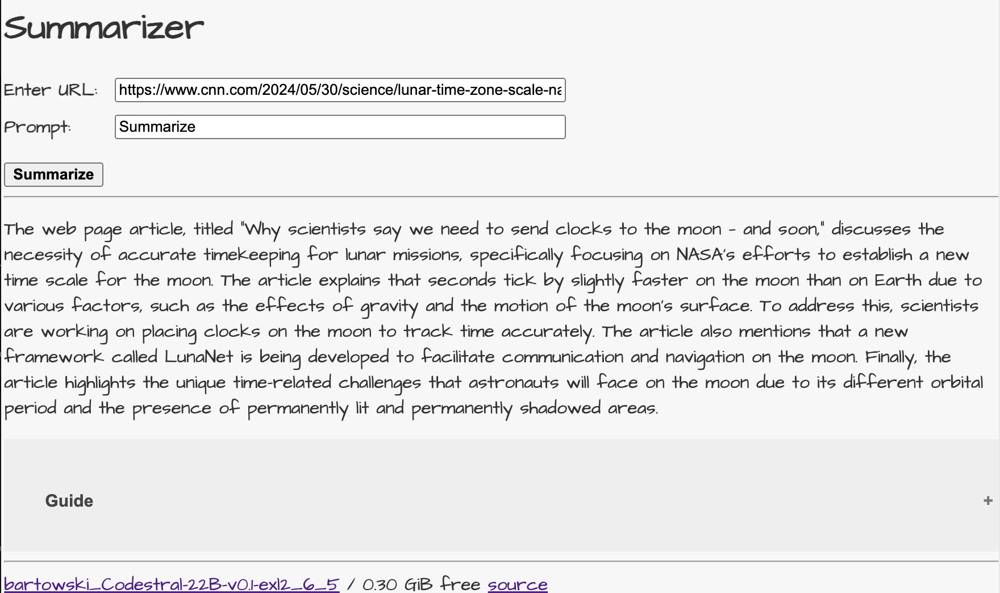
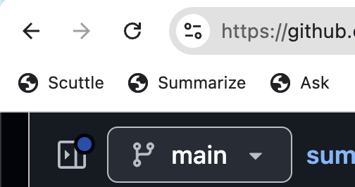

# Summarizer Service
A web application that provides LLM-based text web page summarization for bookmarking services using Flask, subprocesses, and custom scripts.

Summarizer Service is a bare-bones sample Flask web application using Flask, using subprocesses and custom scripts.
The application provides text web page summarization for bookmarking services, accepting both GET and POST requests with or without a custom prompt.

Copyright 2024 Leigh Klotz

## Example



### Installation
The app is designed to use  <a href="https://github.com/leighklotz/llamafiles">llamafiles</a>, but is easily adapted to use other mechanisms for LLM access.

Install <a href="https://github.com/leighklotz/llamafiles">llamafiles</a> and edit `config.py` accordingly.
```bash
cp config.py.example config.py
emacs config.py
```

Clone this repository:
```bash
git clone https://github.com/leighklotz/summarizer-service.git
cd summarizer-service

```
Install dependencies:
```bash
pip install -r requirements.txt
```

### Usage
Here are three options

1. Run with gunicorn
```bash
$ apt install gunicorn
$ ./run.sh
```

2. Run the application with Python

```bash
python app.py

```

2. Run with flask CLI

```bash
flask run --host 127.0.0.1 --port 8080
```

The application will be accessible at `http://localhost:8080`.

3. Run with gunicorn, for example as a service.

```bash
gunicorn -b 0.0.0.0:8080 summarizer_service:app
```

### Cards
- `/`: Home card
- `/scuttle?url=`: Scuttle bookmarking service card
- `/summarize?url=&prompt=`: Text summarization with optional prompt card
- `/via-api-model?model_name=`: List models and select current; POST to load.

Cards are implemented in `app.py` and with templates in `templates/cards/cardname`.

# Bookmarklets
Replace host.example.com with your hostname and add to your browser toolbar.

## Scuttle
Summarize current web page with keywords and open a window to post to Scuttle.


```javascript
javascript:(  function() %7B    var x = document;    var a = encodeURIComponent(x.location.href);    var d = encodeURIComponent(window.getSelection());    open('https://host.example.com/card/scuttle?url=%27%20+%20a%20+%20%27&prompt=%27%20+%20d,%20%27SemanticScuttle%20-%20example.com%27,%20%27modal=1,status=0,scrollbars=1,toolbar=0,resizable=1,width=790,height=465,left=%27%20+%20(screen.width-790)/2%20+%20%27,top=%27%20+%20(screen.height-425)/2);%20%20%7D)();
```

## Summarize
Summarize current web page and open a window with the summary. Current selectin is optional additional prompt.

```javascript
javascript:(  function() %7B    var x = document;    var a = encodeURIComponent(x.location.href);    var d = encodeURIComponent(window.getSelection());    open('https://host.example.com/card/summarize?url=%27%20+%20a%20+%20%27&prompt=%27%20+%20d,%20%27Summarize20-%20example.com%27,%20%27modal=1,status=0,scrollbars=1,toolbar=0,resizable=1,width=790,height=465,left=%27%20+%20(screen.width-790)/2%20+%20%27,top=%27%20+%20(screen.height-425)/2);%20%20%7D)();
```

## Ask
Ask a question (default to current selection) and and open a window with the answer.

```javascript
javascript:(  function() %7B    var x = document;    var d = encodeURIComponent(window.getSelection());    open('https://host.example.com/card/ask?question=%27%20+%20d,%20%27Ask20-%20example.com%27,%20%27modal=1,status=0,scrollbars=1,toolbar=0,resizable=1,width=790,height=465,left=%27%20+%20(screen.width-790)/2%20+%20%27,top=%27%20+%20(screen.height-425)/2);%20%20%7D)();
```

### License
This project is licensed under the MIT License - see the [LICENSE.md](LICENSE.md) file for details.
